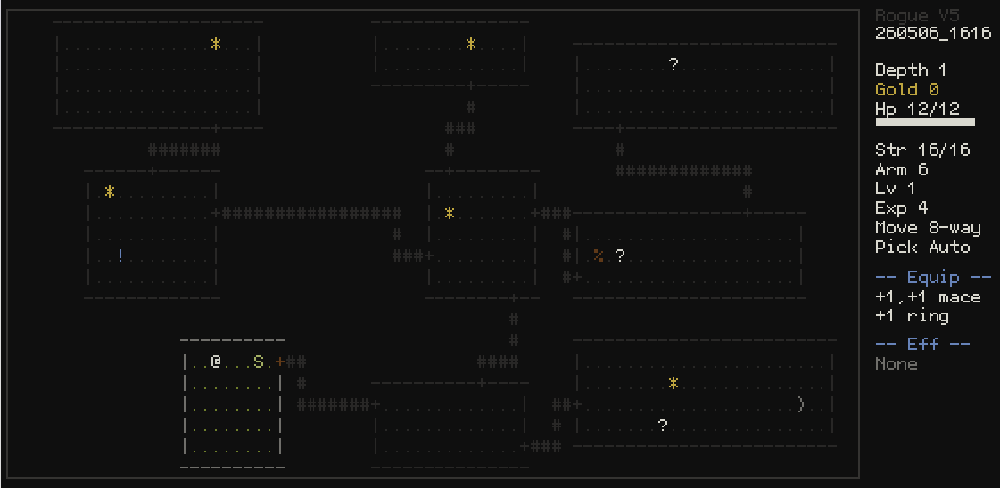

[English | [日本語](README.md)]

# Pyxel Rogue

Pyxel Rogue is an ASCII-based roguelike made with Pyxel, aiming to recreate the original Rogue experience.

The goal is for clearing this Pyxel version to mean that you could clear real Rogue 5.4.4. It keeps the feel of the Rogue V5 line in mind, uses the Rogue 5.4.4 C source as the primary reference for game mechanics, and adapts display, input, and portability for Pyxel and Pyxel Web.

## Goal

- Build an ASCII-based Pyxel version of the original Rogue
- Keep the game logic easy to compare with the Rogue 5.4.4 C source
- Make it playable in browsers, on desktop, SteamDeck, and handheld game devices
- Preserve Rogue-like exploration choices and tension instead of adding overly convenient modern UI
- Grow toward English/Japanese switching while referencing the Japanese Rogue tradition

For detailed design notes, see [DESIGN.md](DESIGN.md). For the task list and current progress, see [TODO.md](TODO.md).

## Screenshot



Gameplay view with the Rogue 5.4.4-style 80-column ASCII map, right-side HUD, and bottom log.

## Play on the Web

You can launch the game in a browser with Pyxel Web Launcher.

[Launch Pyxel Rogue on the Web](https://kitao.github.io/pyxel/web/launcher/?run=hnsol/pyxel-rogue/master/rogue&gamepad=enabled)

The web version lets you try the game without installing Python or Pyxel locally. The URL enables the virtual gamepad, which is useful for phones and tablets.

## Download and Play Locally

Python 3.10+ and Pyxel are required.

```bash
git clone https://github.com/hnsol/pyxel-rogue.git
cd pyxel-rogue
pip install pyxel
pyxel run rogue.py
```

To start with Japanese text:

```bash
PYXEL_ROGUE_LANG=ja pyxel run rogue.py
```

Basic developer checks:

```bash
python3 -m unittest
PYXEL_ROGUE_LANG=ja python3 -m unittest
```

For Rogue 5.4.4 fidelity work, keep the original C source locally as a reference. This directory is ignored by git and is not included in this repository.

```bash
mkdir -p vendor
git clone https://github.com/Davidslv/rogue.git vendor/rogue544
```

## Controls

Gamepad:

- D-pad: Move in 8 directions
- Start tap: Toggle diagonal assist / normal 8-direction mode
- A: Confirm / pick up / stairs / search one tile ahead
- B tap: Menu / cancel
- B hold + D-pad: Dash
- A+B: Wait a turn
- Select: Assist menu
- Assist menu: Inventory / Help / Search / Trap / Pickup / Language / Palette / Quit
- Select+A: Search around all 8 neighboring tiles
- Select+B: Quick throw (choose direction, then item)
- Select+D-pad: Inspect a discovered trap

Keyboard:

- Arrow keys / HJKL: Move
- YUBN: Diagonal movement
- Space: Toggle diagonal assist
- Enter: Confirm / pick up / stairs / search one tile ahead
- Enter+Esc: Wait a turn
- Shift+direction: Dash
- Esc: Menu / cancel
- Tab: Assist menu
- Tab+Enter: Search around all 8 neighboring tiles
- Tab+Esc: Quick throw
- Tab+direction: Inspect a discovered trap
- .: Wait a turn
- s: Search around all 8 neighboring tiles
- t: Quick throw
- ^: Trap Inspect (choose direction)
- i: Inventory
- ?: Help
- q/r/e/z: Quaff / Read / Eat / Zap
- w/W/T: Wear / Wield / Take off

Use Zap from the menu to choose a wand or staff, then choose a direction.

## Current Status

Implemented overview:

- Rogue 5.4.4-style 80x24 logical map, 80x22 terrain view, 576x360 near-16:10 layout, right-side HUD with abbreviated equipment, and seven-line bottom log
- 3x3-sector dungeon generation with rooms, passages, and doors
- 26 monster types, combat, hunger, and natural HP recovery
- Potions, scrolls, food, weapons, armor, rings, identification, inventory, and curses
- Wand/staff 14-type table, random materials, charges, directional Zap entry, light, single-target monster effects, and haste/slow monster effects
- Search, traps, hidden doors, hidden passages, and trap inspection
- Amulet of Yendor and depth-1 return victory while carrying it
- Auto-pickup toggle and throwing animation
- Tombstone death screen
- Startup logo, title screen, and 8-character alphanumeric player name entry
- Weekly Rivals / Season Legends online ranking scaffold for Google Sheets + Apps Script
- Gamepad-oriented A/B/Start/Select + D-pad controls
- JSON message catalogs for English/Japanese text switching, plus logic test foundation
- Bundled Rogue2.Official `mesg_E` / `mesg_J` files as wording reference data

See [TODO.md](TODO.md) for the detailed implementation status.

The default Apps Script URL for online rankings is `https://script.google.com/macros/s/AKfycbx0jUvQm2puooh1rnEGpcjrltLhgbmCFwwoPRqD1qKlDieZhZRaOEdeggRYgTbFdX5t/exec`. Set `PYXEL_ROGUE_SCORE_URL` to override it. Pyxel Rogue calls `?action=seedDummy` during the startup logo, and Apps Script batch-writes only the dummy rows needed to fill the displayed Top 10.

## Roadmap

- Wand/staff bolt, magic missile, and drain life effects
- More Rogue 5.4.4 expectation tests
- HUD / Inventory / Help / Death text catalog coverage
- Responsive layout and font selection
- BGM
- Full score history and online ranking operation improvements
- Replay support

## Links

Rogue / Rogue 5.4.4:

- [RogueBasin: Rogue](https://www.roguebasin.com/?title=Rogue)
- [Davidslv/rogue: Original Rogue Game 5.4.4](https://github.com/Davidslv/rogue)

Rogue Clone / Japanese Rogue:

- [RogueBasin: Rogue Clone](https://www.roguebasin.com/index.php/Rogue_Clone)
- [suzukiiichiro/Rogue2.Official](https://github.com/suzukiiichiro/Rogue2.Official)

Pyxel:

- [Pyxel User Guide](https://kitao.github.io/pyxel/web/user-guide/)
- [kitao/pyxel](https://github.com/kitao/pyxel)
- [Pyxel PyPI](https://pypi.org/project/pyxel/)
- [How To Use Pyxel Web](https://github.com/kitao/pyxel/wiki/How-To-Use-Pyxel-Web/3c7ccc624e95584ecc1c9696628cafca91bff7df)

## License

This project is licensed under the MIT License. See [LICENSE](LICENSE) for details.
